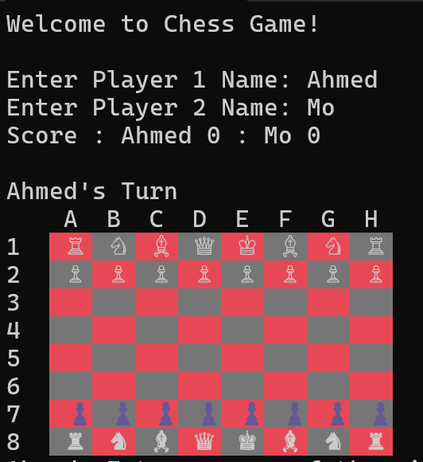
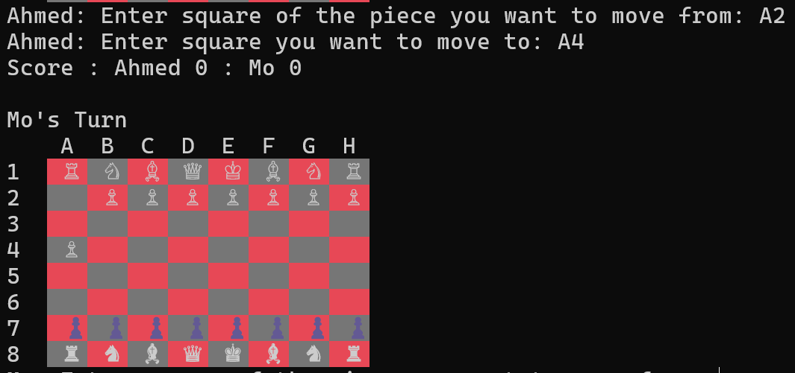
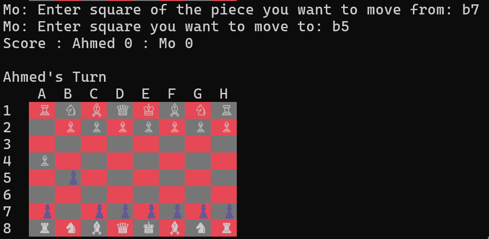
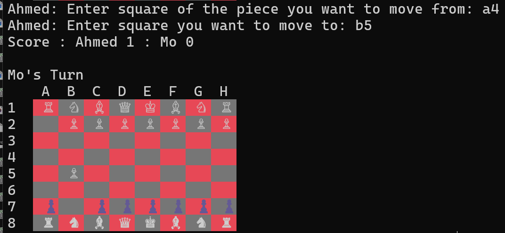

# Chess Game (Console)

A simple console-based chess game written in C# for .NET 8 — playable locally with two players on the same machine.

## ✅ Features
- Console UI with UTF-8 board output
- Player vs Player (local) with move validation, check/checkmate and draw detection
- Score tracking during the session
- Implemented pieces: `Pawn`, `Rook`, `Knight`, `Bishop`, `Queen`, `King`

## ⚙️ Requirements
- .NET SDK 8.0 (Windows)

## ▶️ Build & run
From the project root (where `Chess Game.csproj` is located):

```bash
dotnet build
dotnet run --project "Chess Game.csproj"
```

Or open `Chess Game.sln` in Visual Studio and press F5.

## 🎮 How to play
1. Start the app — you'll be prompted to enter each player's name.
2. On your turn you will be asked for:
   - `Enter square of the piece you want to move from:` (e.g. `E2`) 
   - `Enter square you want to move to:` (e.g. `E4`)
3. Input is case-insensitive. Invalid moves are rejected with a prompt to try again.
4. Game ends on checkmate, stalemate (draw), or when a player reaches the configured win condition.

## 📁 Project structure (key files)
- `Program.cs` — application entry
- `Game.cs` — main game loop and user interaction
- `ChessBoard.cs` — board state, validation, printing
- `BaseChassPiece.cs`, `Pawn.cs`, `Rook.cs`, `Knight.cs`, `Bishop.cs`, `Queen.cs`, `King.cs` — piece logic
- `Player.cs`, `ComputerPlayer.cs` — player logic
- `MoveLog.cs`, `Movement.cs`, `BoardSquareCell.cs` — supporting logic


## � Checkmate demo
A short 2×2 gallery that illustrates a final checkmate sequence. Replace the placeholder images in `assets/screenshots/` with your real screenshots (same filenames) to update the gallery.

<p align="center">
  
   <br/>
  
  <br/>
  
   <br/>
  
</p>
